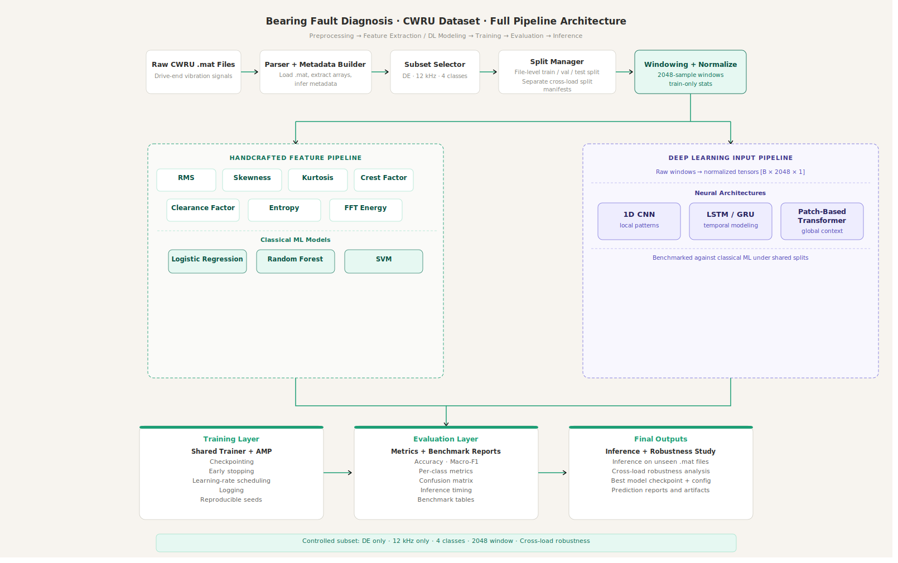

# CWRU Bearing Fault Diagnosis

End-to-end bearing fault classification on the Case Western Reserve University (CWRU) dataset using vibration signal processing, machine learning, and deep learning. This repository focuses on a reproducible benchmarking pipeline, modular project structure, and robustness evaluation under changing operating conditions.

## Overview

Rolling bearing faults are one of the most important failure sources in rotating machinery, and vibration analysis is a widely used non-intrusive approach for predictive maintenance and condition monitoring.[web:17][web:3] The CWRU Bearing Data Center dataset is a standard benchmark for this problem because it provides normal and faulty bearing recordings with documented operating conditions, vibration channels, and MATLAB-format files.

This project builds a complete fault diagnosis pipeline on top of that dataset with three priorities:

- Reproducible and leakage-safe preprocessing.
- Fair benchmarking across ML and DL model families.
- Robustness testing through cross-load generalization.



## Project Objective

The main objective is to build a four-class fault classification system on a controlled subset of the CWRU dataset and compare multiple model families under the same preprocessing and evaluation setup.

### Version 1 scope

- Sensor channel: Drive End (DE) only.
- Sampling rate: 12 kHz only.
- Task: 4-class classification.
- Classes:
  - `normal`
  - `inner_race`
  - `ball`
  - `outer_race`
- Window length: 2048 samples.
- Window overlap: 50%.
- Main improvement experiment: Cross-load robustness.

This restricted scope is intentional. The original dataset includes multiple channels and multiple sampling regimes, and mixing everything too early weakens both implementation quality and result interpretation.

## Dataset

This repository uses the **Case Western Reserve University Bearing Data Center** dataset.

### Why CWRU

The dataset contains vibration recordings for normal and faulty bearings collected on a motor test rig, and the public data files are distributed in MATLAB format.[web:17][web:20][web:3] Each file contains drive-end and fan-end vibration data, and the dataset includes different operating loads, which makes it useful for both baseline classification and robustness studies.

### Dataset subset used here

To keep the benchmark controlled and reproducible, version 1 uses:

- 12 kHz recordings only.
- Drive-end vibration only.
- Four fault-type classes only.
- File-level splitting before windowing.

## Problem Formulation

This is a supervised multi-class classification problem.

### Input

A fixed-length 1D vibration signal window extracted from a source recording.

### Output

One of four labels:

- `normal`
- `inner_race`
- `ball`
- `outer_race`

## End-to-End Pipeline

The project follows this workflow:

1. Parse raw `.mat` files.
2. Build a metadata table from file contents and file naming patterns.
3. Filter to 12 kHz drive-end recordings.
4. Map samples into the 4-class label space.
5. Split by original source recording before segmentation.
6. Segment signals into 2048-sample windows with 50% overlap.
7. Fit normalization on the training split only.
8. Train ML and DL models.
9. Evaluate using accuracy, macro-F1, per-class metrics, confusion matrices, and timing.
10. Run a cross-load robustness benchmark.
11. Aggregate predictions for inference on unseen recordings.

The split-before-windowing rule is critical because sliding-window leakage can make fault diagnosis benchmarks look much better than they really are.

## Model Families

The repository benchmarks multiple model families under one shared data pipeline.

### Classical machine learning

These models use handcrafted time-domain and frequency-domain features:

- Logistic Regression
- Random Forest
- Support Vector Machine (SVM)

### Deep learning

These models use raw normalized vibration windows:

- 1D CNN
- LSTM / GRU baseline
- Patch-based 1D Transformer

This comparison is deliberate. A single-model project is much weaker than a benchmarked project with controlled preprocessing and shared evaluation logic.

## Main Improvement: Cross-Load Robustness

The primary extension beyond the standard benchmark is cross-load robustness. Since the CWRU dataset contains different motor load conditions, the project tests whether models trained on some loads generalize to unseen loads.

This is a better first improvement than adding arbitrary architectural complexity because it addresses a real weakness of many laboratory fault diagnosis pipelines: poor generalization outside the training condition.

## Repository Structure

```text
cwru-bearing-fault-diagnosis/
├── README.md
├── assets/
│   ├── project_architecture.svg
├── requirements.txt
├── .gitignore
├── configs/
│   ├── data.yaml
│   ├── ml_baseline.yaml
│   ├── cnn_baseline.yaml
│   ├── lstm_baseline.yaml
│   ├── transformer_baseline.yaml
│   └── cross_load.yaml
├── notebooks/
│   ├── 01_dataset_audit.ipynb
│   ├── 02_preprocessing_and_windowing.ipynb
│   ├── 03_feature_baselines.ipynb
│   ├── 04_cnn_baseline.ipynb
│   ├── 05_lstm_baseline.ipynb
│   ├── 06_transformer_baseline.ipynb
│   ├── 07_benchmark_comparison.ipynb
│   ├── 08_cross_load_robustness.ipynb
│   ├── 09_error_analysis.ipynb
│   └── 10_inference_demo.ipynb
├── src/
│   ├── data/
│   ├── features/
│   ├── models/
│   ├── train/
│   ├── eval/
│   ├── infer/
│   └── utils/
├── scripts/
├── artifacts/
└── demo/
```

## Core Modules

### `src/data`

- `.mat` file parsing
- Metadata construction
- Label mapping
- File-level split generation
- Windowing and normalization
- PyTorch dataset creation

### `src/features`

- Time-domain features
- Frequency-domain features
- Feature matrix pipeline for ML baselines

### `src/models`

- ML baseline wrappers
- 1D CNN
- LSTM / GRU baseline
- Patch-based Transformer

### `src/train`

- Shared training engine
- Trainer abstraction
- Checkpointing and callbacks
- Loss handling

### `src/eval`

- Accuracy and macro-F1
- Confusion matrices
- Timing utilities
- Benchmark summary reports

### `src/infer`

- Unseen-sample prediction
- Window-level to file-level aggregation

## Planned Experiments

| Experiment | Goal | Notes |
|---|---|---|
| Standard benchmark | Compare ML, CNN, LSTM, and Transformer on the same split | Core benchmark |
| Window-size ablation | Compare 2048 vs 1024 windows | Accuracy vs efficiency tradeoff |
| Cross-load robustness | Evaluate generalization to unseen loads | Main improvement experiment |

## Evaluation Metrics

Each model is evaluated with:

- Accuracy
- Macro-F1
- Per-class precision, recall, and F1
- Confusion matrix
- Parameter count
- Training time
- Inference latency

Macro-F1 is included because multi-class fault diagnosis should not be judged only by top-line accuracy.

## Results

Results will be added after the benchmark pipeline is implemented and validated.

| Model | Input | Accuracy | Macro-F1 | Params | Train Time | Notes |
|---|---|---:|---:|---:|---:|---|
| Logistic Regression | Handcrafted features | TBD | TBD | TBD | TBD | ML baseline |
| Random Forest | Handcrafted features | TBD | TBD | TBD | TBD | ML baseline |
| SVM | Handcrafted features | TBD | TBD | TBD | TBD | Main classical baseline |
| 1D CNN | Raw windows | TBD | TBD | TBD | TBD | Main convolutional baseline |
| LSTM / GRU | Raw windows | TBD | TBD | TBD | TBD | Sequential baseline |
| Transformer | Raw windows / patches | TBD | TBD | TBD | TBD | Attention-based baseline |

## Tech Stack

- Python
- NumPy / Pandas / SciPy
- scikit-learn
- PyTorch
- Matplotlib / Seaborn
- Jupyter / Kaggle Notebooks

## Setup

### Clone the repository

```bash
git clone https://github.com/<your-username>/cwru-bearing-fault-diagnosis.git
cd cwru-bearing-fault-diagnosis
```

### Create a virtual environment

```bash
python -m venv .venv
source .venv/bin/activate
```

On Windows:

```bash
.venv\Scripts\activate
```

### Install dependencies

```bash
pip install -r requirements.txt
```

## Usage

### Build metadata

```bash
python scripts/build_metadata.py --config configs/data.yaml
```

### Create splits

```bash
python scripts/make_splits.py --config configs/data.yaml
```

### Train ML baseline

```bash
python scripts/train_ml.py --config configs/ml_baseline.yaml
```

### Train CNN baseline

```bash
python scripts/train_cnn.py --config configs/cnn_baseline.yaml
```

### Train LSTM baseline

```bash
python scripts/train_lstm.py --config configs/lstm_baseline.yaml
```

### Train Transformer baseline

```bash
python scripts/train_transformer.py --config configs/transformer_baseline.yaml
```

### Run cross-load benchmark

```bash
python scripts/run_cross_load.py --config configs/cross_load.yaml
```

## Recommended Execution Order

1. Audit raw dataset files.
2. Build metadata table.
3. Validate file-level split and windowing logic.
4. Train ML baselines.
5. Train CNN baseline.
6. Train LSTM baseline.
7. Train Transformer baseline.
8. Compare all models under the same evaluation setup.
9. Run cross-load robustness benchmark.
10. Build inference demo and finalize results.

## Reproducibility Notes

This repository is designed for reproducible experimentation:

- Config-driven runs
- Fixed random seeds
- Explicit split manifests
- Saved checkpoints and metrics
- Shared evaluation logic across models
- Script-based execution outside notebooks

## Future Work

Possible extensions after version 1:

- Fault-size-aware classification
- Outer-race position-aware experiments
- 48 kHz subset experiments
- Lightweight Transformer for deployability
- Dual-branch raw + FFT architectures
- Streamlit or Gradio inference app
- Multi-sensor fusion using DE + FE channels

## Acknowledgment

This project uses the CWRU Bearing Data Center dataset provided by Case Western Reserve University.[web:17][web:20] The implementation is positioned as a benchmark-driven predictive maintenance project inspired by bearing fault diagnosis literature, not as an exact reproduction of a single paper.
